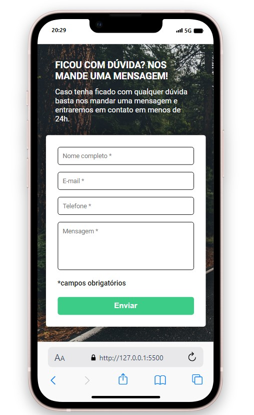

## Formulário Dinâmico: Validação com Estilo! 🎨

Este projeto demonstra um formulário interativo com validação básica, utilizando HTML, CSS e JavaScript. 

**Funcionalidades:**

* **Validação:** O formulário verifica se todos os campos obrigatórios foram preenchidos.
* **Feedback Visual:** 
    * **Sucesso:** Se todos os campos forem preenchidos, os inputs ganham uma borda verde, indicando que o formulário está pronto para ser enviado.
    * **Erro:** Se algum campo estiver vazio, os inputs recebem uma borda vermelha, alertando o usuário sobre a necessidade de preenchimento. 
    * **Mensagem de Erro:**  Uma mensagem "Campos obrigatórios" aparece abaixo do formulário caso algum campo esteja vazio.

                             **Visão do Projeto**

    
     
    
    

**Como Usar:**

1. **Clone o repositório:** `git clone [https://github.com/DEV-Cafe096/form-challenge.git]`
2. **Abra o arquivo `index.html` em seu navegador.**
3. Experimente preencher o formulário e observe a validação e o feedback visual!

**Tecnologias:**

* **HTML:** Estrutura do formulário.
* **CSS:** Estilização do formulário e dos elementos de feedback.
* **JavaScript:** Lógica de validação e manipulação do DOM.

**Observações:**

* O projeto demonstra um exemplo simples de validação de formulário. 
* Para aplicações reais, recomenda-se implementar validações mais robustas e personalizadas.

**Contribuições:**

Contribuições são bem-vindas! Você pode:

* Adicionar novos campos ao formulário.
* Implementar validações mais complexas.
* Melhorar a interface do usuário.

**Divirta-se explorando este projeto!** 😄

  

